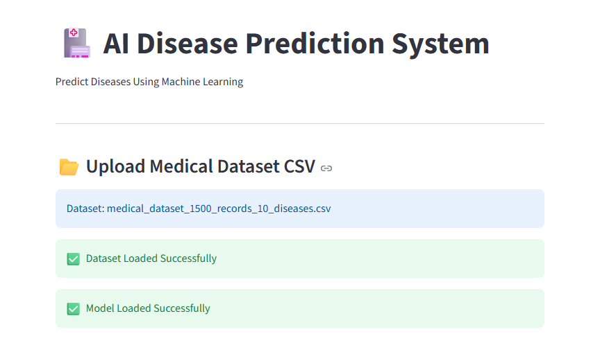
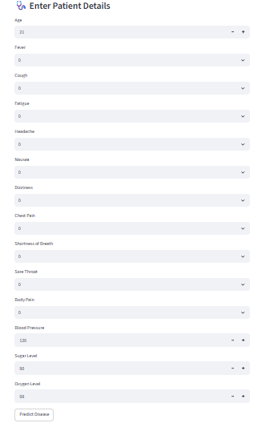
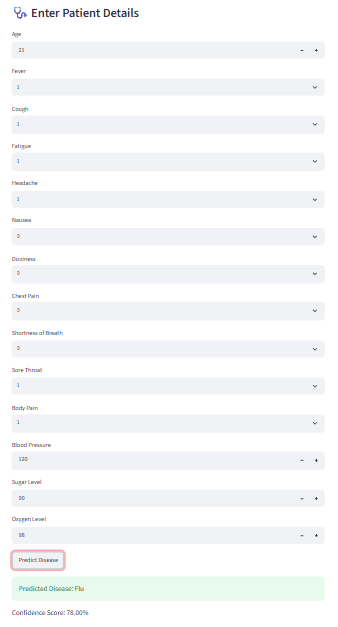

# 🩺 Disease Prediction Using AI & Machine Learning

<p align="center">
  
  
  
  
</p>

## 📌 Project Overview

Disease Prediction Using AI & Machine Learning is an intelligent healthcare application that predicts possible diseases based on user symptoms using Machine Learning algorithms.

The application provides a simple and interactive interface where users can enter medical information and receive instant disease predictions.

> **Note:** This project is developed for educational and research purposes only and should not be used as a replacement for professional medical advice.

---

# 🚀 Features

- 🩺 Disease Prediction
- 🤖 Machine Learning Model
- 📊 User-Friendly Dashboard
- ⚡ Fast Prediction
- 📈 Accurate Classification
- 📋 Medical Information Input
- 💻 Responsive Interface
- 📱 Easy to Use

---

# 🛠️ Technologies Used

- Python
- Scikit-Learn
- Pandas
- NumPy
- Streamlit
- Matplotlib
- Pickle

---

# 📂 Project Structure

```
Disease-Prediction-using-AI-ML/
│
├── datasets/
├── models/
├── results/
│   ├── home.png
│   ├── prediction.png
│   ├── result.png
│   ├── dashboard.png
│   └── accuracy.png
│
├── app.py
├── train_model.py
├── requirements.txt
└── README.md
```

---

# 📸 Application Screenshots

## 🏠 Home Page

<p align="center">

</p>

---

## 📝 Mainn Page

<p align="center">

</p>

---

## 📊 Test Result

<p align="center">

</p>

---

# ⚙️ Installation

## Clone Repository

```bash
git clone https://github.com/morthasandeep777/Disease-Prediction-using-AI-ML.git
```

Move into the project directory

```bash
cd Disease-Prediction-using-AI-ML
```

Install dependencies

```bash
pip install -r requirements.txt
```

Run the application

```bash
streamlit run app.py
```

---

# 🧠 Machine Learning Workflow

```
Medical Dataset
       │
       ▼
Data Preprocessing
       │
       ▼
Feature Engineering
       │
       ▼
Model Training
       │
       ▼
Model Evaluation
       │
       ▼
Disease Prediction
```

---

# 📊 Project Highlights

- Machine Learning Based Prediction
- Healthcare Analytics
- Interactive User Interface
- Fast Response Time
- Easy Deployment
- Clean Project Structure

---

# 🔮 Future Enhancements

- AI Health Chatbot
- Voice Symptom Recognition
- PDF Report Generation
- Prediction History
- User Login System
- Admin Dashboard
- Mobile Application
- Dark Mode
- Cloud Deployment

---

# 📄 License

This project is intended for educational purposes.

---

# 👨‍💻 Author

## Mortha Sandeep

🎓 B.Tech (Artificial Intelligence & Machine Learning)

📍 Aditya University

🌐 Portfolio

https://mortha-sandeep-portfolio.vercel.app/

🐙 GitHub

https://github.com/morthasandeep777

💼 LinkedIn

https://linkedin.com/in/your-linkedin-profile

---

# ⭐ Support

If you found this project helpful,

⭐ Star this repository

🍴 Fork it

📝 Share it with others

---

<p align="center">
Made with ❤️ by <b>Mortha Sandeep</b>
</p>
